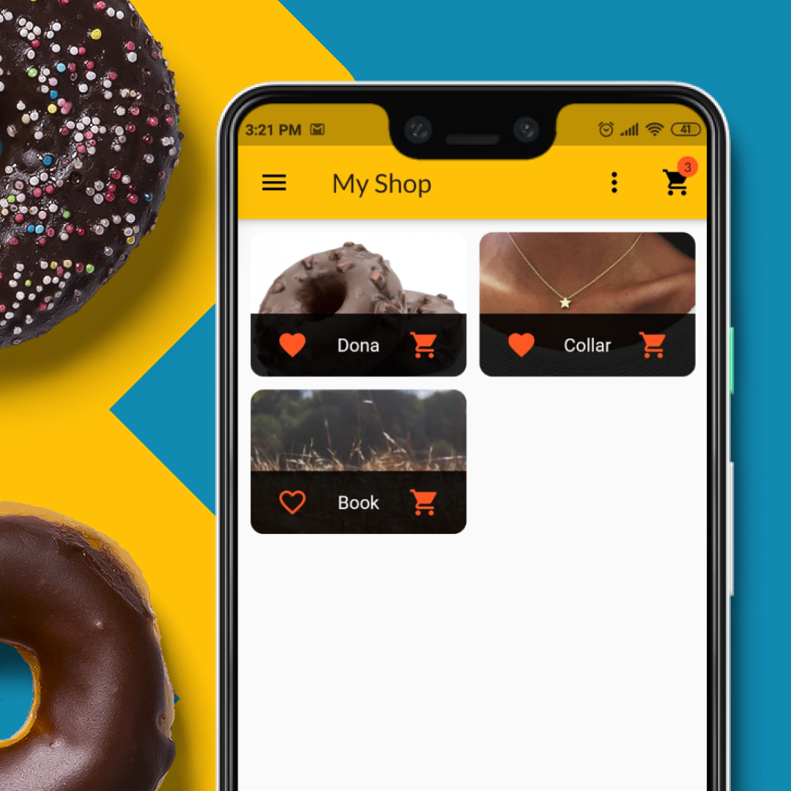

# Shop App 🛒
MVP flutter app that allows its user to sell products in the app and see all the products on sale in the main page.
<h2 align="center">
    
   
</h2>

## Features 💡
⚡️ OAuth\
⚡️ Firebase database\
⚡️ State management

## Technologies used 🛠️
- [Flutter](https://parceljs.org/getting_started.html/) - UI toolkit for crafting beautiful, natively compiled applications
- [Firebase - Realtime DB](https://firebase.google.com/products/realtime-database) - Backend service for realtime data sync
